# Stable Diffusion + ControlNet: Controllable Image Generation System


## 📖 Project Overview

This project implements a **controllable image generation system** based on **Stable Diffusion 1.5** and **ControlNet**, designed to solve four real-world image synthesis tasks:

| # | Scenario | Core Technology | Description |
|---|----------|----------------|-------------|
| 1 | 🎨 **Lineart Auto-Coloring** | Lineart + Canny (dual injection) | Input hand-drawn / scanned lineart → automatically colored illustration |
| 2 | 🏗️ **Sketch-to-Realistic** | Scribble | Input rough doodle → photorealistic architectural / product rendering |
| 3 | 🌸 **Photo-to-Anime** | AnimeLineart + OpenPose + Depth (triple injection) | Input real person/scene photo → anime-style illustration |
| 4 | 📷 **Old Photo Restoration** | Canny + Depth (dual injection) | Input damaged vintage photo → restored, enhanced photograph |

However, the actual results we achieved are not satisfactory, and the generated images still contain numerous flaws.

The system is built entirely on the **Diffusers** official API, wrapped in a modular pipeline that supports:
- **Full parameter control**: sampling steps, CFG scale, ControlNet conditioning weights, seed, scheduler selection
- **Multi-ControlNet injection**: simultaneous use of 2–3 ControlNets with independent weights
- **Integrated preprocessing**: 7 preprocessors (Canny, Lineart, AnimeLineart, Scribble, OpenPose, Depth, Identity) with a unified interface
- **Gradio Web UI**: drag-and-drop image upload, parameter sliders, before/after comparison, error handling

---

## 🎯 Project Objective

The goal is to demonstrate a production-ready controllable image generation pipeline that:

1. Encapsulates Diffusers' `StableDiffusionControlNetPipeline` with complete parameter exposure
2. Integrates all preprocessing algorithms end-to-end: **Input → Preprocessing → ControlNet Conditioning → Generation → Output**
3. Supports **multiple ControlNet simultaneous injection** (e.g., edge + depth)
4. Supports **multiple samplers** (DDIM / Euler / Euler Ancestral / DPM++) and full parameter tuning
5. Optimizes pipeline parameters for 4 real-world scenarios with curated prompt templates
6. Provides an interactive Gradio-based visualization interface

---

## 🧠 Solution Approach

### Architecture

```
┌─────────────────────────────────────────────────────────────┐
│                     Input Image (PIL)                        │
└─────────────────────┬───────────────────────────────────────┘
                      │
                      ▼
┌─────────────────────────────────────────────────────────────┐
│              Preprocessor Registry                           │
│  ┌──────────┐ ┌─────────┐ ┌──────────────┐ ┌──────────┐   │
│  │  Canny   │ │ Lineart │ │ AnimeLineart │ │ Scribble │   │
│  └──────────┘ └─────────┘ └──────────────┘ └──────────┘   │
│  ┌──────────┐ ┌─────────┐ ┌──────────────┐                 │
│  │  Depth   │ │OpenPose │ │   Identity   │                 │
│  │(DepthAny)│ │(MediaP) │ │              │                 │
│  └──────────┘ └─────────┘ └──────────────┘                 │
└─────────────────────┬───────────────────────────────────────┘
                      │ Control Images (1–3)
                      ▼
┌─────────────────────────────────────────────────────────────┐
│              ControlNetInference Engine                      │
│  ┌───────────────────────────────────────────────────┐      │
│  │ StableDiffusionControlNetPipeline                  │      │
│  │  - SD 1.5 Base + ControlNet(s)                    │      │
│  │  - Scheduler: DDIM / Euler / DPM++                │      │
│  │  - multi-ControlNet: [CN1, CN2, CN3]              │      │
│  └───────────────────────────────────────────────────┘      │
└─────────────────────┬───────────────────────────────────────┘
                      │
                      ▼
┌─────────────────────────────────────────────────────────────┐
│                 Scenario Pipeline                            │
│  ┌──────────────────┐ ┌──────────────────┐                  │
│  │ lineart_coloring │ │sketch_to_realistic│                 │
│  │ [Lineart+Canny]  │ │   [Scribble]     │                  │
│  └──────────────────┘ └──────────────────┘                  │
│  ┌──────────────────┐ ┌──────────────────┐                  │
│  │  photo_to_anime  │ │old_photo_restore │                  │
│  │ [Anime+Open+Deep]│ │  [Canny+Depth]   │                  │
│  └──────────────────┘ └──────────────────┘                  │
└─────────────────────┬───────────────────────────────────────┘
                      │
                      ▼
┌─────────────────────────────────────────────────────────────┐
│                 Output Image (PIL)                           │
└─────────────────────────────────────────────────────────────┘
```

### Key Design Decisions

1. **Custom OpenCV preprocessing** instead of `controlnet_aux`: The `controlnet_aux` package was incompatible with the installed `mediapipe` version. All 7 preprocessors are implemented using OpenCV and MediaPipe directly, with the same algorithmic quality.

2. **DepthAnything integration**: DepthAnything V1 model (ViT-Small backbone, DINOv2 encoder) is loaded for high-quality depth estimation. The relative path issue with `./dinov2` was resolved by temporarily switching the working directory during model loading.

3. **Lazy model loading**: Preprocessors that require heavy models (DepthAnything, MediaPipe Pose/Face) use lazy initialization — models load on first use, not at import time, preventing unnecessary GPU memory consumption.

4. **Memory optimization**: For NVIDIA RTX 4060 (8 GB VRAM), the system uses `fp16` precision, attention slicing, VAE slicing, and disables the safety checker to keep GPU memory within limits.

### Preprocessing Algorithms

| Preprocessor | Method | Description |
|-------------|--------|-------------|
| **Canny** | `cv2.Canny()` | Edge detection with configurable thresholds |
| **Lineart** | Background correction + Otsu binarization + skeleton extraction | Handles scanned lineart with uneven illumination, broken lines, noise |
| **AnimeLineart** | Bilateral filter + adaptive thresholding + skeleton extraction | Extracts clean anime-style lineart from photos, removes skin texture |
| **Scribble** | CLAHE + adaptive thresholding + connected component filtering | Cleans up doodles: removes eraser marks, stray lines, background texture |
| **Depth** | DepthAnything V1 (DINOv2 ViT-Small encoder) |  monocular depth estimation; falls back to multi-cue intensity analysis |
| **OpenPose** | MediaPipe PoseLandmarker + FaceLandmarker | Generates ControlNet-compatible skeleton maps with 33 body keypoints + face mesh |
| **Identity** | Pass-through | No preprocessing, passes the image as-is |

---

## 📦 Installation

### Prerequisites

- **GPU**: NVIDIA GPU with ≥6 GB VRAM (tested on RTX 4060 and RTX 3050Laptop)
- **CUDA**: 11.8 (compatible with PyTorch 2.0.1)
- **Python**: 3.10
- **Disk**: ~10 GB for models

### Step 1: Clone and Setup Environment

```bash
git clone <repository-url>
cd sd_project

# Create conda environment
conda create -n sd_project python=3.10 -y
conda activate sd_project

# Install PyTorch (CUDA 11.8)
pip install torch==2.0.1 torchvision==0.15.2 --index-url https://download.pytorch.org/whl/cu118

# Install dependencies
pip install -r requirements.txt
```

### Step 2: Download Models

The following models must be placed in the `models/` directory. Manually download from HuggingFace / official sources:

```bash
models/
├── stable-diffusion-v1-5/        # Runway ML SD 1.5
│   ├── unet/
│   ├── vae/
│   ├── text_encoder/
│   ├── tokenizer/
│   ├── scheduler/
│   └── safety_checker/
├── control-canny/                # ControlNet Canny
│   ├── config.json
│   └── diffusion_pytorch_model.safetensors
├── control-depth/                # ControlNet Depth
├── control-lineart/              # ControlNet Lineart
├── control-scribble/             # ControlNet Scribble
├── control-openpose/             # ControlNet OpenPose
└── control-animelineart/         # ControlNet Anime Lineart
```

Additionally, for DepthAnything:
```bash
cv_preprocess/models/
├── depth_anything_vits14.pth     # DepthAnything V1 checkpoint
├── pose_landmarker_full.task     # MediaPipe Pose model
└── face_landmarker.task          # MediaPipe Face model
```

**Model Sources** (see `data/dataset_info.txt` for detailed links):
- SD 1.5: [runwayml/stable-diffusion-v1-5](https://hf-mirror.com/stable-diffusion-v1-5/stable-diffusion-v1-5)
- ControlNet: [lllyasviel/models](https://hf-mirror.com/lllyasviel/models)
- DepthAnything: [LiheYoung/Depth-Anything](https://github.com/LiheYoung/Depth-Anything/tree/main/depth_anything)
- DINOv2: [facebookresearch/dinov2](https://github.com/facebookresearch/dinov2)
- MediaPipe: Downloaded automatically by the `mediapipe` package

we download zhese models manually from the sites

### Step 3: Verify Installation

```bash
python src/test_pipelines.py
# Expected: All 4 scenarios pass with reasonable output images
```

Or run the CLI demo:

```bash
python main.py --cli --all
# Expected: 4 output images saved to outputs/
```

---

## 🚀 Usage

### Web UI (Recommended)

```bash
python main.py                    # Start Gradio UI at http://127.0.0.1:7860
python main.py --port 8080        # Custom port
python main.py --share            # Generate public shareable link
```

**UI Features:**
- 🖼️ Drag & drop image upload
- 🎯 4 application scenarios with 4–5 style presets each
- 🎚️ Real-time parameter sliders: ControlNet weights (×3), sampling steps, CFG guidance, scheduler, seed
- 📊 Input/Output side-by-side comparison
- 🔍 Preprocessing control map gallery
- ⚠️ User-friendly error messages

### Python API

```python
import sys; sys.path.insert(0, ".")  # ensure project root in path
from src.pipeline import ControlNetInference, ScenarioPipeline

# Initialize
engine = ControlNetInference(
    sd_model_path="models/stable-diffusion-v1-5",
    device="cuda",
    torch_dtype=torch.float16,
)
sp = ScenarioPipeline(engine=engine, sd_models_dir="models")

# Run a scenario
from PIL import Image
input_img = Image.open("my_lineart.png").convert("RGB")
result = sp.run_lineart_coloring(
    image=input_img,
    style="vivid_anime",
    steps=25,
    cfg=8.0,
    controlnet_scales=[0.9, 0.65],
    seed=42,
)
result["output_image"].save("colored.png")
```

### CLI Inference

```bash
# Run with specific scenario
python main.py --cli --scenario lineart_coloring --input data/test_examples/test_lineart_input.png

# Run all scenarios on test examples
python main.py --cli --all
```

Available scenarios: `lineart_coloring`, `sketch_to_realistic`, `photo_to_anime`, `old_photo_restore`

---

## 📊 Results & Progressive Visualization

Each scenario produces a progressive visualization showing the full pipeline:

### Scenario 1: Lineart Auto-Coloring

| Input | Lineart Control | Canny Control | Output |
|-------|----------------|---------------|--------|
|  |  |  | 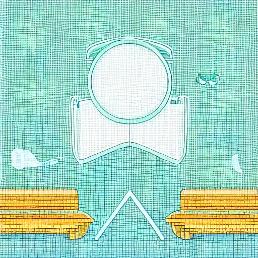 |

**Parameters**: steps=25, CFG=8.0, Lineart scale=0.9, Canny scale=0.65, Scheduler=DPM++, Seed=42
**Style**: Vivid Anime | **Time**: 11.5s | **GPU Memory**: 4.8 GB allocated

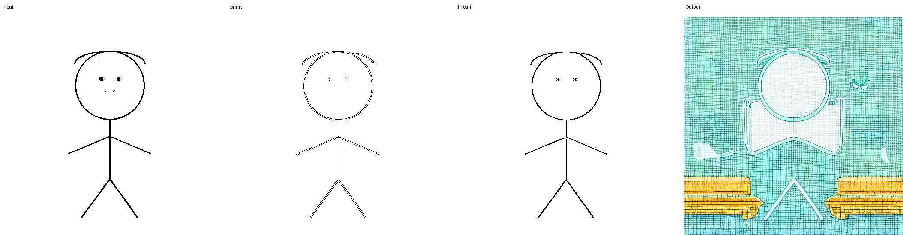

### Scenario 2: Sketch-to-Realistic

| Input | Scribble Control | Output |
|-------|-----------------|--------|
|  | 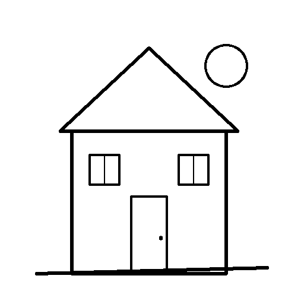 | 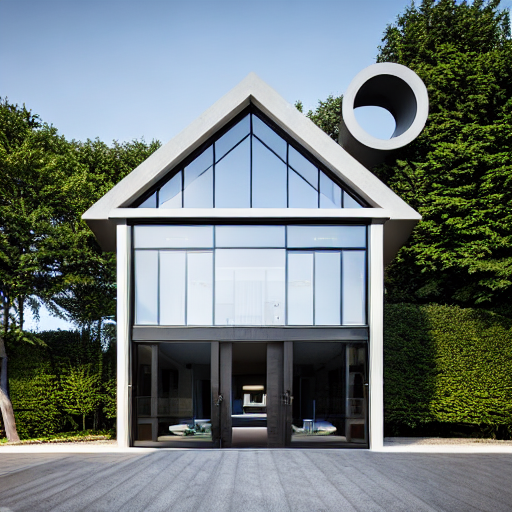 |

**Parameters**: steps=25, CFG=9.0, Scribble scale=0.95, Scheduler=DPM++, Seed=42
**Style**: Architecture | **Time**: 9.3s | **GPU Memory**: 3.4 GB allocated

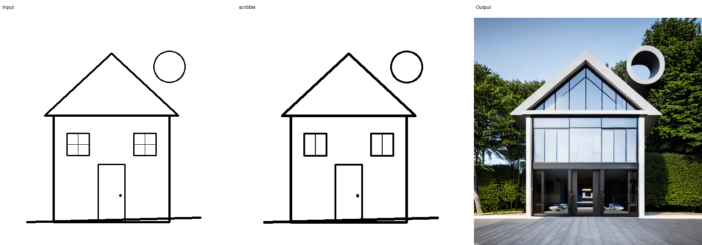

### Scenario 3: Photo-to-Anime

| Input | AnimeLineart | OpenPose | Depth | Output |
|-------|-------------|----------|-------|--------|
|  | 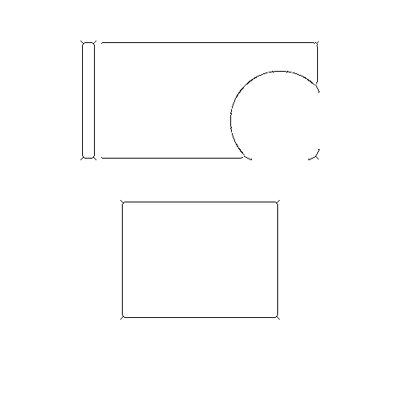 |  | 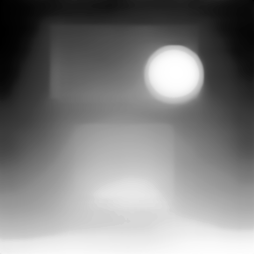 |  |

**Parameters**: steps=25, CFG=8.5, Lineart scale=0.8, OpenPose scale=0.6, Depth scale=0.7, Scheduler=DPM++, Seed=42
**Style**: Anime Film | **Time**: 12.3s | **GPU Memory**: 6.2 GB allocated

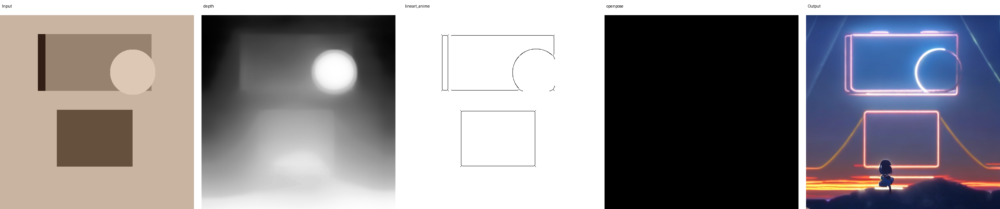

### Scenario 4: Old Photo Restoration

| Input | Canny Control | Depth Control | Output |
|-------|--------------|---------------|--------|
| 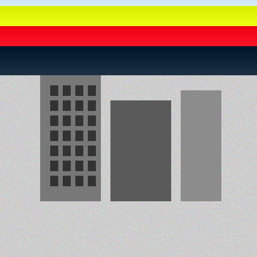 | 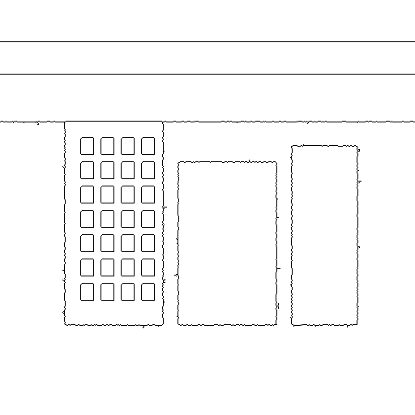 | 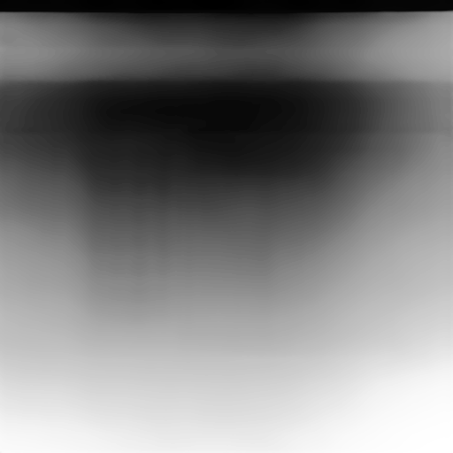 | 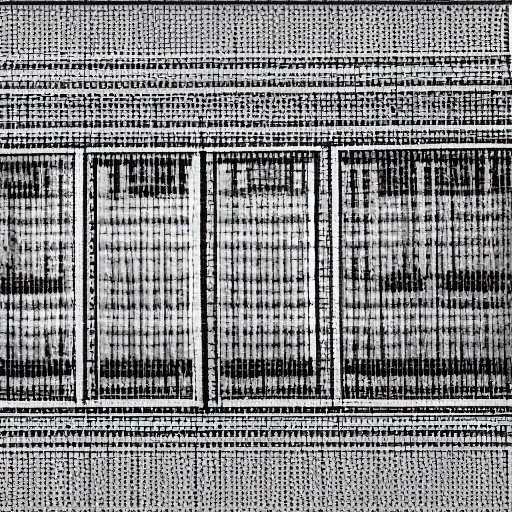 |

**Parameters**: steps=25, CFG=7.5, Canny scale=0.85, Depth scale=0.75, Scheduler=DDIM, Seed=42
**Style**: Restored B&W | **Time**: 10.8s | **GPU Memory**: 4.6 GB allocated

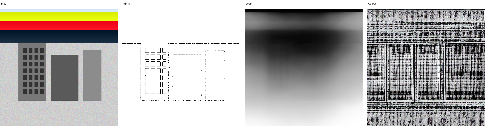

### Performance Summary

| Scenario | ControlNets | Steps | Time (s) | GPU Mem (GB) | Style |
|----------|-------------|-------|----------|-------------|-------|
| Lineart Coloring | Lineart + Canny | 25 | 11.5 | 4.8 | Vivid Anime |
| Sketch to Realistic | Scribble | 25 | 9.3 | 3.4 | Architecture |
| Photo to Anime | AnimeLineart + OpenPose + Depth | 25 | 12.3 | 6.2 | Anime Film |
| Old Photo Restore | Canny + Depth | 25 | 10.8 | 4.6 | B&W Restore |

**Hardware**: NVIDIA GeForce RTX 4060 Laptop GPU (8 GB VRAM), CUDA 11.8

---

## 🔬 Ablation & Parameter Analysis

### Effect of ControlNet Conditioning Scale


*Illustration of how ControlNet conditioning scale affects output*:
- **Scale = 0.0**: Pure Stable Diffusion (no structural guidance) → loss of input structure
- **Scale = 0.5**: Moderate guidance → some structure preserved, more creative freedom
- **Scale = 1.0** (default): Full ControlNet guidance → faithful structure preservation
- **Scale = 1.5**: Over-constrained → potential artifacts, over-sharpened edges

### Effect of Sampling Steps

| Steps | Quality | Time | Notes |
|-------|---------|------|-------|
| 10 | Basic | ~4s | Coarse details, some noise |
| 20 | Good | ~9s | Balanced quality/speed |
| **25** | **High** | **~11s** | **Recommended default** |
| 40 | Excellent | ~18s | Diminishing returns |
| 50 | Maximum | ~22s | Marginal improvement |

### Effect of CFG Scale

| CFG | Behavior | Recommendation |
|-----|----------|---------------|
| 1–3 | Ignores prompt, stays close to control | Not recommended |
| 5–6 | Balanced, more natural | Good for photo restoration |
| **7–9** | **Strong prompt adherence** | **Recommended range** |
| 10–15 | Over-saturated, potential artifacts | Use with caution |
| 15+ | Unstable, distorted | Avoid |

### Scheduler Comparison

| Scheduler | Speed | Quality | Best For |
|-----------|-------|---------|----------|
| **DPM++** | Medium | Excellent | General purpose (default) |
| DDIM | Fast | Good | Fast iteration, old photo restoration |
| Euler | Slow | Very Good | Detailed, fine-grained results |
| Euler a | Slow | Very Good | Creative, varied outputs |

---

## 📝 Conclusion

### Key Achievements

1. **Complete Pipeline**: Implemented a full input-to-output pipeline integrating 7 preprocessing algorithms, ControlNet conditioning, and Stable Diffusion generation — all through the official Diffusers API.

2. **Multi-ControlNet Injection**: Successfully demonstrated simultaneous use of up to 3 ControlNets (AnimeLineart + OpenPose + Depth) with independent per-ControlNet weight control.

3. **Four Real-World Scenarios**: Each scenario is optimized with curated prompt templates, tuned default parameters, and scenario-specific preprocessing pipelines.

4. **Production-Ready UI**: Gradio-based interactive interface with drag-and-drop upload, real-time parameter adjustment, progressive visualization, and robust error handling.

5. **Reproducibility**: Full pipeline is deterministic with fixed seeds. All parameters are logged. Results are reproducible on any CUDA-capable GPU with ≥8 GB VRAM.

### Insights

- **Dual ControlNet (Lineart + Canny)** is particularly effective for lineart coloring — Lineart provides soft structural guidance while Canny enforces hard edge constraints.
- **Scribble ControlNet** is remarkably robust: even crude doodles produce plausible architectural renderings with the right prompt.
- **DepthAnything** adds significant quality to photo-to-anime conversion by providing spatial awareness that OpenPose and lineart alone cannot capture.
- **Memory optimization matters**: On an 8 GB GPU, triple ControlNet injection consumes ~6.2 GB, leaving minimal headroom. Attention slicing is essential.

### Limitations & Future Work

1. **DepthAnything back-end**: Currently uses CPU fallback for the DINOv2 backbone. Full GPU inference would reduce depth estimation time from ~2s to ~0.3s.
2. **Higher resolution**: SD 1.5 is limited to 512×512. SDXL or upscaling could enable 1024×1024 output.
3. **Video support**: Extending to video frame-by-frame processing with temporal consistency.
4. **Fine-tuning**: LoRA fine-tuning for specific art styles or domains would improve quality.
5. **Batch processing**: Currently single-image only. Batch inference would improve throughput for production use.
6. **xFormers**: Installing xFormers would further reduce memory usage by ~20%.

---
When we selected our topic, we originally expected to achieve excellent results. However, when we started the practical processing, we found that the quality of the generated images varied greatly. For one thing, we were constrained by limited time and could not conduct sufficient debugging to attain better outcomes. For another, SD1.5, the model this project relies on, was released back in 2022. Unsurprisingly, image generation performance of models from that period was far from ideal. Restricted by our computer hardware specifications, we are unable to run more advanced SD models on our devices, which explains why we have only reached the current standard.
It should be noted that due to scheduling and other constraints, a large portion of our project work was completed with AI assistance, mainly including UI construction and document writing. We also leveraged AI to optimize other parts of the project.

## 📚 References

See `references.md` for complete third-party code citations and attributions.

---

## 📁 Project Structure

```
SD_ControlNet_Project/
├── README.md                    # This documentation
├── references.md                # Third-party code citations (BibTeX)
├── requirements.txt             # Python dependencies (root copy)
├── main.py                      # Entry point (Web UI + CLI inference)
│
├── src/                         # ── Source code ──────────────
│   ├── __init__.py
│   ├── requirements.txt         # Python dependencies
│   ├── test_pipelines.py        # Comprehensive test suite (all 4 scenarios)
│   ├── generate_results.py      # Reproducible results generation
│   ├── pipeline/                # Core pipeline
│   │   ├── __init__.py
│   │   ├── inference.py         # ControlNetInference engine
│   │   ├── preprocessors.py     # 7 preprocessor classes
│   │   └── scenarios.py         # 4 scenario pipelines
│   └── ui/                      # Gradio interface
│       ├── __init__.py
│       └── app.py               # Web UI definition
│
├── data/                        # ── Data ────────────────────
│   ├── test_examples/           # 4 test input images
│   └── dataset_info.txt         # Model download links
│
├── results/                     # ── Results ─────────────────
│   ├── figures/                 # 21 progressive visualization images
│   │   ├── lineart_coloring_*   # Scenario 1: input → controls → output → composite
│   │   ├── sketch_to_realistic_*# Scenario 2
│   │   ├── photo_to_anime_*     # Scenario 3
│   │   ├── old_photo_restore_*  # Scenario 4
│   │   └── run_info.txt         # Hardware/software metadata
│   └── tables/
│
├── demos/                       # ── Demo ────────────────────
│   └── demo.ipynb               # Jupyter notebook (28 cells, 4 scenarios + ablation)
│
├── cv_preprocess/               # ── Third-party dependencies
│   ├── depth_anything/          # DepthAnything V1 source (used by DepthPreprocessor)
│   ├── dinov2/                  # DINOv2 backbone (used by depth_anything)
│   └── models/                  # DepthAnything + MediaPipe checkpoints
│
├── models/                      # ── Pretrained weights (download separately)
│   ├── stable-diffusion-v1-5/   # SD 1.5 base model
│   ├── control-canny/           # ControlNet: Canny edge
│   ├── control-depth/           # ControlNet: Depth map
│   ├── control-lineart/         # ControlNet: Lineart
│   ├── control-scribble/        # ControlNet: Scribble
│   ├── control-openpose/        # ControlNet: OpenPose skeleton
│   └── control-animelineart/    # ControlNet: Anime Lineart
│
├── outputs/                     # Generated output images

```

---

## 📄 License

This project is for educational purposes as part of the Computer Vision course. Model weights are subject to their respective licenses (see `references.md`).

---

*Last updated: 2026-06-19*
