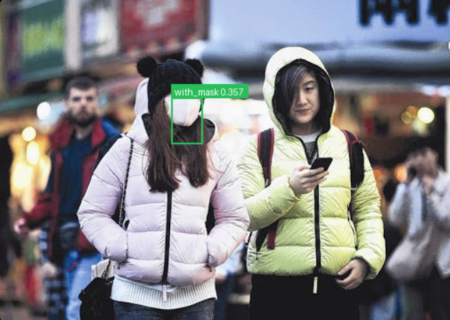

# LASA: A Layer-Adaptive Systolic Accelerator for Edge AI on MPSoC

LASA (Layer-Adaptive Systolic Accelerator) is an INT8 inference system for
single-scale YOLOv3-tiny on the AMD/Xilinx Kria KV260. The project includes
synthesizable Verilog RTL, a Vivado Block Design, a Vitis bare-metal runtime,
quantized deployment data, RTL and board-level verification tools, and
ready-to-use XSA and bitstream artifacts.

The system implements an end-to-end path from a DDR image, through PS/PL
coordinated execution of ten convolution layers, to YOLO detection decoding.
The accompanying paper is available as [Thesis.pdf](Thesis.pdf).

## Hardware Project Submission Note

This is an FPGA/MPSoC hardware project. Therefore, the software-oriented
`main.py` and Jupyter Notebook deliverables are replaced by:

- synthesizable RTL and XSIM regression tests;
- a Vitis bare-metal inference runtime;
- reproducible KV260 programming and execution scripts;
- bit-exact Conv0-Conv9 golden verification;
- a real-image DDR inference demonstration.

The primary execution entry points are:

```text
sw/vitis_2022_2/src/main.c
sw/vitis_2022_2/scripts/run_kv260_image_demo.ps1
sw/vitis_2022_2/scripts/run_kv260_smoke_sequence.ps1
```

## Project Objective

CNN accelerator performance is not determined by peak MAC throughput alone.
In a complete network, DMA startup, feature-map reordering, weight loading,
partial-sum feedback, K-pass synchronization, and software/hardware scheduling
bubbles can leave the processing array idle.

LASA addresses these system-level overheads while supporting the heterogeneous
layer shapes found in YOLOv3-tiny. The project aims to:

1. execute native `1x1` and `3x3` convolutions on one configurable array;
2. preserve bit-exact integer inference semantics across the complete network;
3. reduce PS/PL communication and feature-layout conversion overhead;
4. overlap partial-sum feedback and next-pass preparation;
5. provide measurable, reproducible board-level results.

## Main Contributions

- A `ROWS=18`, `COLS=8` dual-output-lane INT8 systolic array. Each pass
  computes `COUT_TILE=16` output channels with INT32 partial sums.
- Native `1x1` and `3x3` convolution paths. Native `1x1` execution avoids the
  redundant K passes caused by sparse `3x3` mapping.
- Input zero-point centering, fixed-point requantization, per-channel
  parameters, activation LUTs, and optional `2x2/stride2` max-pooling.
- KCS three-dimensional tiling across K passes, output-channel blocks, and
  spatial tiles.
- BSD (Batched Streaming Dataflow) to reduce PS service events and DMA
  startups.
- OCRR (On-Chip Reorder and Replay), which stores raw-HWC data in URAM and
  performs on-chip `1x1/3x3` reordering and replay.
- OPF-P (Overlapped PSUM Feedback and Prefetch) to overlap partial-sum
  feedback, drain, and next-K-pass preparation.
- A verification flow spanning unit RTL simulation, real-layer external
  golden data, Conv0-Conv9 board-level bit-exact checks, and real-image
  inference.

## System Architecture

```text
DDR image / quantized model data
        |
        v
ARM Cortex-A53 bare-metal runtime
  layer descriptors / AXI-Lite / DMA / cache maintenance
        |
        v
Bias DMA + Weight DMA + IFM DMA
        |
        v
LASA programmable logic
  loader -> HWC cache/replay -> systolic array -> PSUM
         -> requant -> activation -> pooling -> OFM writer
        |
        v
OFM DMA -> DDR feature buffer -> next layer / YOLO decode
```

The Processing System (PS) manages layer descriptors, DMA scheduling,
inter-layer feature buffers, output reordering, and YOLO decoding. The
Programmable Logic (PL) performs convolution, partial-sum accumulation,
requantization, activation, pooling, and OFM streaming.

Four AXI DMA channels carry bias, weight, IFM, and OFM data. AXI-Lite is used
for layer configuration and performance-counter access.


*LASA executing the single-scale YOLOv3-tiny network on a Kria KV260.*

## Network and Integer Data Path

The runtime executes a ten-layer single-scale YOLOv3-tiny path from Conv0 to
Conv9. Layers are described by dimensions, kernel mode, K-pass count, output
channel blocks, spatial tiles, quantization parameters, activation mode, and
pooling configuration.

The hardware integer semantics are:

```text
uint8 IFM
  -> subtract input zero point and saturate to signed INT8
  -> signed INT8 convolution with signed INT8 weights
  -> INT32 partial-sum accumulation and INT32 bias
  -> Q15 fixed-point requantization
  -> activation LUT
  -> optional max-pooling
  -> uint8 OFM
```

## Results and Analysis

The paper experiments use a KV260/XCK26, Vivado/Vitis 2022.2, and a 100 MHz
PL clock. The final paper configuration passes Conv0-Conv9 batch-chain
bit-exact verification and produces stable detections on two DDR images.

| Metric | Result |
| --- | ---: |
| Paper end-to-end DDR demo latency | approximately 288 ms |
| PL hardware busy time | 247.184 ms |
| Effective array `compute_fire` time | 74.323 ms |
| Single-core Cortex-A53 INT8 baseline | 2540.175 ms |
| Speedup over the A53 baseline | 8.82x |
| Speedup over the early 1.18 s hardware chain | approximately 4.1x |

Implementation results for the paper configuration:

| Resource or timing metric | Result |
| --- | ---: |
| CLB LUTs | 84,480 |
| CLB Registers | 53,260 |
| BRAM Tiles | 63 |
| URAMs | 24 |
| DSPs | 184 |
| WNS | +0.092 ns |
| TNS | 0 ns |
| Routing errors | 0 |

The repository also includes the fully board-validated
`kv260_hwcreplay_22` release. Its fixed-image DDR demo measures approximately
`280.340 ms` and produces one `with_mask` detection with confidence
`0.357321`. The paper's `288 ms` result and the released `280.340 ms` artifact
come from different validated builds using the same `18x8` array and the
Vivado/Vitis 2022.2 toolchain.



*Fixed DDR test image: `with_mask`, confidence approximately `0.357`.*

## Repository Structure

```text
cal/                     DSP and INT8 multiplication primitives
com/                     Common RTL modules
systolic/                LASA accelerator RTL
tb/                      Verilog testbenches and Python regression tests
tcl/                     XSIM, synthesis, and KV260 system build scripts
sw/vitis_2022_2/         Vitis bare-metal runtime and board scripts
tools/golden/            RTL-semantic golden and network export tools
tools/demo/              Image preparation and UART performance tools
docs/                    Architecture, registers, verification, and history
golden/                  Small RTL regression fixtures and policy
repro/                   Deployment parameters, test image, expected output
release/kv260_hwcreplay_22/
                         Released XSA and bitstream
Thesis.pdf               Project paper
```

Hardware dataflow and register definitions are documented in
[docs/hardware_dataflow_and_registers.md](docs/hardware_dataflow_and_registers.md).
The RTL verification scope is documented in
[docs/rtl_test_plan.md](docs/rtl_test_plan.md).

## Requirements

- Windows 10/11 and PowerShell 5 or later
- AMD/Xilinx Vivado 2022.2
- AMD/Xilinx Vitis 2022.2
- Python 3.9 or a compatible version
- Kria KV260, JTAG, and a 115200-baud UART connection
- Optional: Icarus Verilog for lightweight RTL tests

The scripts currently reference:

```text
C:\Xilinx\Vivado\2022.2
C:\Xilinx\Vitis\2022.2
```

Update the paths in the PowerShell and Tcl scripts if the tools are installed
elsewhere.

## Reproducibility Package

The `repro/` directory contains the minimum deployment data needed to build
and verify the Conv0-Conv9 Vitis application:

- quantized layer weights;
- INT32 biases;
- activation LUTs;
- per-layer RTL-semantic golden outputs;
- one fixed test image;
- the expected Conv9 tensor and YOLO decode result.

The full training dataset, PyTorch checkpoint, and intermediate PSUM dumps are
not included. This keeps the repository focused on hardware deployment rather
than redistributing a large training environment.

Verify the package with:

```powershell
Get-FileHash repro\images\maksssksksss0.png -Algorithm SHA256
Get-Content repro\SHA256SUMS
```

See [repro/README.md](repro/README.md) for the package format.

## RTL Simulation

Run the short XSIM regression:

```powershell
powershell -ExecutionPolicy Bypass -File tb/run_short_xsim_regression.ps1
```

Run a selected top-level test, for example the Conv6 `3x3` raw-HWC full-tile
test:

```powershell
& 'C:\Xilinx\Vivado\2022.2\bin\vivado.bat' `
  -mode batch `
  -source tcl\run_xsim_regression.tcl `
  -tclargs -top tb_conv_accel_core_axi_lite_axis_stream_conv6_3x3_raw_hwc_fulltile_cout16
```

The test suite covers AXI-Lite configuration, AXI-Stream backpressure,
weight/IFM loaders, native `1x1/3x3`, partial sums, requantization, activation,
pooling, and real-layer dataflow.

## Building the KV260 Hardware

Generate the Block Design, bitstream, and XSA with Vivado 2022.2:

```powershell
& 'C:\Xilinx\Vivado\2022.2\bin\vivado.bat' `
  -mode batch `
  -source tcl\build_kv260_system_xck26.tcl `
  -tclargs -build_dir D:/MPSoC/build_lasa_kv260 -jobs 12
```

Main build parameters:

```text
ROWS=18
COLS=8
COUT_TILE=16
IFM_BANKS=2
HWC_CACHE_AW=16
HWC_CACHE_DEPTH=43264
HWC_CACHE_STRIPES=4
HWC_CACHE_USE_URAM=1
TAIL_CYCLES=1
```

To skip implementation, use the released artifacts:

```text
release/kv260_hwcreplay_22/conv_accel_ps_dma_minimal.xsa
release/kv260_hwcreplay_22/conv_accel_ps_dma_wrapper.bit
```

Their SHA256 hashes are listed in
[release/kv260_hwcreplay_22/README.md](release/kv260_hwcreplay_22/README.md).

## Building the Vitis Bare-Metal Runtime

Create or update the Vitis platform and BSP:

```powershell
& 'C:\Xilinx\Vitis\2022.2\bin\xsct.bat' `
  sw/vitis_2022_2/scripts/create_accel_smoke_project.tcl
```

Build the ten-layer DDR image demo:

```powershell
powershell -ExecutionPolicy Bypass `
  -File sw/vitis_2022_2/scripts/manual_build_accel_smoke.ps1 `
  -Mode conv0_conv9_ddr_demo
```

The build script reads deployment data from `repro/model/` and generates
weights in the byte order consumed by the hardware. Additional build modes are
described in [sw/vitis_2022_2/README.md](sw/vitis_2022_2/README.md).

## Running on the KV260

For the first run, perform full PL programming. Replace `COM8` and the build
directory with the local UART port and Vivado output directory:

```powershell
powershell -ExecutionPolicy Bypass `
  -File sw/vitis_2022_2/scripts/run_kv260_image_demo.ps1 `
  -Image repro\images\maksssksksss0.png `
  -PortName COM8 `
  -BuildDirName D:\MPSoC\build_lasa_kv260 `
  -CaptureSeconds 240
```

Run the Conv0-Conv9 layer-by-layer RTL-semantic golden comparison:

```powershell
powershell -ExecutionPolicy Bypass `
  -File sw/vitis_2022_2/scripts/run_kv260_smoke_sequence.ps1 `
  -PortName COM8 `
  -BuildDirName D:\MPSoC\build_lasa_kv260 `
  -RunConv0Conv9BatchChain `
  -CaptureSeconds 240
```

The scripts program the hardware, download the ELF, capture UART output, and
compare the detection result with `repro/expected/decode_golden.json`.

## Verification Methodology

LASA uses three verification levels:

1. Unit RTL tests check handshakes, backpressure, addressing, K-pass control,
   and quantization boundaries.
2. Real-layer XSIM tests compare every output byte against external
   RTL-semantic golden data.
3. The KV260 batch-chain checks every Conv0-Conv9 layer bit-exactly, while the
   DDR demo verifies image input, inter-layer buffering, and YOLO decoding.

Golden data for later layers must be generated by the same RTL-semantic chain.
Quantization, activation, and pooling differences in an earlier layer
propagate into all later layers.

## Upstream Project and Attribution

An important upstream reference is
[adamgallas/fpga_accelerator_yolov3tiny](https://github.com/adamgallas/fpga_accelerator_yolov3tiny).
Its Python project supplied the face-mask inference model, training workflow,
and INT8 quantization method used as the basis for this project's deployment
data.

The following dual-INT8 DSP multiplication modules are derived from that
project:

- [`cal/cal_mul_int8_x2.v`](cal/cal_mul_int8_x2.v)
- [`cal/cal_mul_int8_x2_dsp.v`](cal/cal_mul_int8_x2_dsp.v)

They form the multiplication primitive used by LASA's dual-output-lane PE.
Beyond these explicitly identified modules, this project redesigns the
layer-adaptive PE/array interconnect and RTL data path for KV260/XCK26, as well
as KCS, BSD, OCRR, OPF-P, AXI DMA integration, the Vitis scheduler, and the
Conv0-Conv9 verification system.

The upstream project is licensed under the
[Apache License 2.0](https://github.com/adamgallas/fpga_accelerator_yolov3tiny/blob/main/LICENSE)
and cites:

> Xiang Chen, Jindong Li, and Yong Zhao, "Hardware Resource and Computational
> Density Efficient CNN Accelerator Design Based on FPGA," ICTA 2021.

## Conclusion

LASA demonstrates a complete FPGA/MPSoC deployment rather than an isolated
convolution kernel. It combines a configurable INT8 systolic array with
runtime-controlled dataflow, on-chip feature replay, partial-sum management,
quantized post-processing, and board-level diagnostics.

The final system executes the full Conv0-Conv9 single-scale YOLOv3-tiny path
on the KV260, passes layer-by-layer bit-exact verification, and performs
real-image face-mask detection in approximately 0.28-0.29 seconds.

For the complete architecture, optimization methodology, ablation study, and
resource analysis, see [Thesis.pdf](Thesis.pdf).
