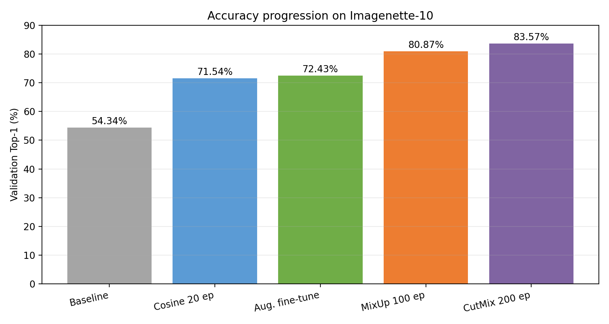
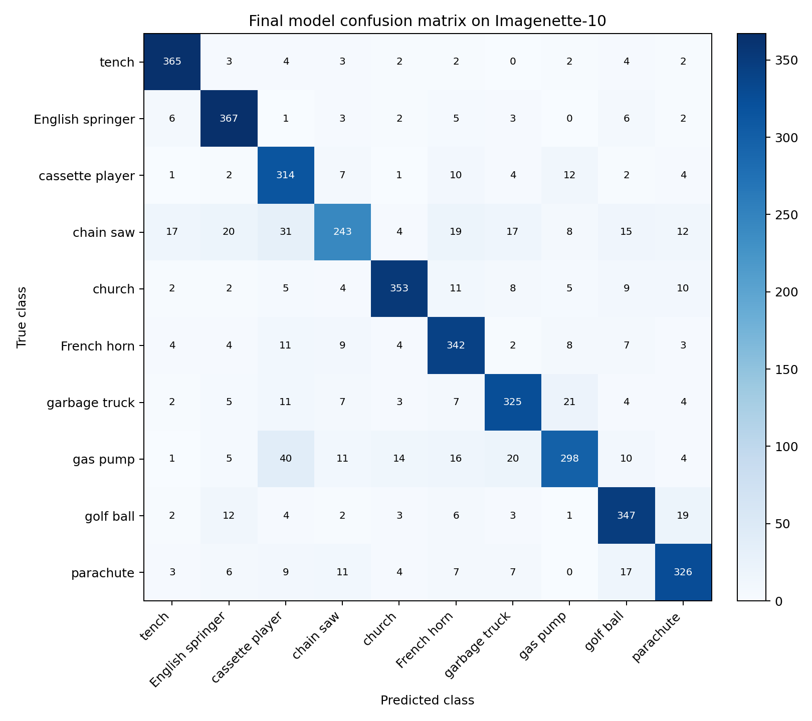
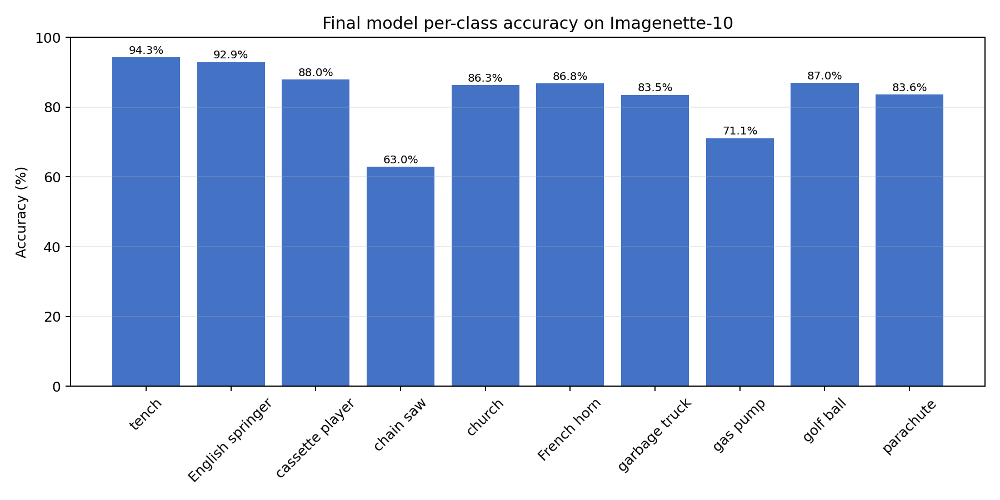

# Vision Transformer for Image Classification

## Project Objective

This project implements a **Vision Transformer (ViT)** from scratch in PyTorch for
ImageNet-style image classification. The goal is to build a working ViT model
without relying on pretrained weights or external ViT library implementations,
train it on real image data, and progressively improve its accuracy through
algorithmic and regularization techniques.

**Task:** Supervised image classification — given a 224×224×3 RGB image, predict
its class label from a fixed set of categories.

## Solution Approach

We implement a Vision Transformer based on Dosovitskiy et al. (2021), "An Image
is Worth 16x16 Words." The architecture follows a standard encoder-only
Transformer design adapted for 2D images:

1. **Patch Embedding** — Split a 224×224 image into 16×16 non-overlapping
   patches (196 total) and project each into a 256-dimensional token via a
   strided convolution.
2. **Class Token** — Prepend a learnable `[CLS]` token; its final
   representation serves as the image-level feature for classification.
3. **Position Embedding** — Add learnable 2D-aware positional embeddings
   `(1, 197, 256)` to retain spatial information.
4. **Transformer Encoder** — Stack 6 pre-normalization Transformer blocks, each
   with multi-head self-attention (8 heads), a 4× MLP expansion with GELU
   activation, and residual connections.
5. **Classification Head** — Extract the `[CLS]` token after a final LayerNorm
   and pass it through a linear layer to produce class logits.

**Key design choices:**
- Pre-norm (LayerNorm before attention/MLP) for training stability.
- No `[SEP]` token or segment embeddings — not needed for single-image input.
- All modules (`PatchEmbedding`, `MultiHeadSelfAttention`, `MLP`,
  `TransformerBlock`) are implemented from scratch in one readable file.

For practical training, we use **Imagenette-10** (a 10-class ImageNet subset
with 9,469 training and 3,925 validation images) instead of full ImageNet-1K.
This keeps training feasible on a consumer GPU while preserving ImageNet-like
visual statistics.

## Project Structure

```
├── README.md                          # This file
├── references.md                      # Citations and third-party attribution
├── src/
│   ├── main.py                        # Inference entry point (demo on test images)
│   ├── vit.py                         # ViT model definition (from scratch)
│   ├── infer.py                       # Single-image inference CLI
│   ├── utils.py                       # Shared utilities: checkpoint loading, prediction
│   ├── eval_report.py                 # Evaluation: confusion matrix, per-class metrics
│   └── requirements.txt               # Python dependencies
├── data/
│   ├── dataset_info.txt               # Dataset description, source URL, preprocessing
│   └── test_examples/                 # 3 images for the inference demo
├── results/
│   ├── figures/
│   │   ├── accuracy_progression.png   # Accuracy across experiment stages
│   │   ├── vit_architecture.png       # Model architecture diagram
│   │   ├── confusion_matrix.png       # Final model confusion matrix
│   │   └── per_class_accuracy.png     # Per-class accuracy bar chart
│   └── tables/
│       ├── evaluation_summary.json    # Final evaluation metrics
│       └── per_class_accuracy.csv     # Per-class accuracy breakdown
├── demos/
│   └── inference_demo.ipynb           # Jupyter notebook: load model, predict, analyze
└── reports/
    └── 基于Vision Transformer的图像分类网络设计、训练与优化_最终提交版.docx
```

## Installation

### Prerequisites

- Python 3.10 or later
- CUDA-capable GPU recommended (the model runs on CPU but inference is slower)

### Setup

```bash
# Clone the repository
git clone <repo-url>
cd <repo-root>

# Install dependencies
pip install -r src/requirements.txt
```

**Dependencies:** PyTorch, torchvision, matplotlib, numpy, Pillow, jupyter.

## Dataset and Preprocessing

### Imagenette-10

We use **Imagenette-160** (full-size variant), a 10-class subset of ImageNet-1K
curated by [fast.ai](https://github.com/fastai/imagenette).

| Property | Value |
|----------|-------|
| Source | https://s3.amazonaws.com/fast-ai-imageclas/imagenette2-160.tgz |
| Training images | 9,469 |
| Validation images | 3,925 |
| Classes | 10 (tench, English springer, cassette player, chain saw, church, French horn, garbage truck, gas pump, golf ball, parachute) |

### Download & Extract

```bash
# Option 1: Use the built-in downloader
python src/vit.py --download-imagenette --epochs 1 --max-train-batches 1 --max-val-batches 1

# Option 2: Download manually
wget https://s3.amazonaws.com/fast-ai-imageclas/imagenette2-160.tgz -P data/
tar -xzf data/imagenette2-160.tgz -C data/
```

The expected directory layout after extraction:

```
data/imagenette2-160/
├── train/
│   ├── n01440764/   # tench
│   ├── n02102040/   # English springer
│   └── ... (8 more)
└── val/
    ├── n01440764/
    └── ...
```

### Preprocessing

**Training:**
1. `RandomResizedCrop(224)`
2. `RandomHorizontalFlip(0.5)`
3. `RandAugment(N=2, M=9)` (final recipe)
4. `Normalize(mean=[0.485,0.456,0.406], std=[0.229,0.224,0.225])`
5. `RandomErasing(p=0.25)` (final recipe)

**Validation / Inference:**
1. `Resize(256)`
2. `CenterCrop(224)`
3. `ToTensor()`
4. `Normalize(mean=[0.485,0.456,0.406], std=[0.229,0.224,0.225])`

## Training Instructions

### Quick Start — Forward Pass Only

```bash
python src/vit.py --forward-only
```

Expected output: `(2, 1000)` logits from random input.

### Full Training — Final Recipe (83.57%)

```bash
python src/vit.py \
  --data-root data/imagenette2-160 \
  --epochs 200 \
  --batch-size 32 \
  --num-workers 2 \
  --lr 3e-4 \
  --min-lr 1e-6 \
  --warmup-epochs 5 \
  --weight-decay 0.05 \
  --mixup-alpha 0.2 \
  --cutmix-alpha 1.0 \
  --drop-path 0.1 \
  --scheduler cosine \
  --rand-augment \
  --random-erasing 0.25 \
  --output-dir outputs_v3 \
  --metrics-csv outputs_v3/metrics.csv
```

The best checkpoint is saved automatically as `outputs_v3/vit_imagenette10_best.pt`.

### Training Commands for Earlier Stages

<details>
<summary>Baseline (4 epochs, 54.34%)</summary>

```bash
python src/vit.py --data-root data/imagenette2-160 --epochs 4 --batch-size 32 \
  --num-workers 2 --output-dir outputs
```
</details>

<details>
<summary>Cosine + Label Smoothing (20 epochs, 71.54%)</summary>

```bash
python src/vit.py --data-root data/imagenette2-160 --epochs 20 --batch-size 32 \
  --num-workers 2 --lr 3e-4 --scheduler cosine --min-lr 1e-5 \
  --label-smoothing 0.1 --output-dir outputs_cosine20
```
</details>

<details>
<summary>Augmented Fine-tune (10 epochs, 72.43%)</summary>

```bash
python src/vit.py --data-root data/imagenette2-160 --epochs 10 --batch-size 32 \
  --num-workers 2 --lr 1e-4 --scheduler cosine --min-lr 1e-6 \
  --label-smoothing 0.05 --rand-augment --random-erasing 0.25 \
  --init-checkpoint outputs_cosine20/vit_imagenette10_best.pt \
  --output-dir outputs_aug_finetune
```
</details>

### Evaluation — Generate Figures & Metrics

```bash
python scripts/generate_final80_assets.py \
  --checkpoint outputs_v3/vit_imagenette10_best.pt \
  --model-file src/vit.py \
  --data-root data/imagenette2-160 \
  --output-dir reports/final_eval_836 \
  --expected-samples 3925 \
  --expected-correct 3280
```

## Inference Demo

### Command Line — Single Image

```bash
# Default checkpoint (outputs_v3/vit_imagenette10_best.pt)
python src/infer.py --image data/test_examples/example_1_tench.JPEG --topk 5

# Custom checkpoint
python src/infer.py --image path/to/image.jpg --checkpoint path/to/checkpoint.pt
```

### Command Line — Batch Demo on Test Images

```bash
# Run on all 3 bundled test images
python src/main.py

# Single image
python src/main.py --image data/test_examples/example_2_springer.JPEG
```

Expected output:

```
Summary: 3/3 test images correctly classified
```

### Jupyter Notebook

Open `demos/inference_demo.ipynb` in Jupyter Lab or Jupyter Notebook. The
notebook walks through:

1. Environment setup and imports
2. Loading the 83.57% checkpoint
3. Image preprocessing explanation
4. Displaying the 3 test images
5. Running top-5 predictions
6. Comparing expected vs. predicted labels
7. Brief analysis and discussion

The full notebook runs in under 2 minutes on a machine with a GPU.

## Progressive Results and Analysis

| Stage | Key Techniques | Epochs | Val Top-1 | Improvement |
|-------|---------------|--------|-----------|-------------|
| 1. Baseline | Basic training | 4 | 54.34% | — |
| 2. Schedule | +Label Smoothing, +Cosine LR | 20 | 71.54% | +17.20 |
| 3. Augmentation | +RandAugment, +RandomErasing (fine-tune) | 10 | 72.43% | +0.89 |
| 4. MixUp + DropPath | +Warmup, +MixUp, +DropPath (from scratch) | 100 | 80.87% | +8.44 |
| 5. **CutMix (Final)** | **+CutMix, extended training** (from scratch) | **200** | **83.57%** | **+2.70** |



### Analysis

**Stage 1 → 2:** The largest absolute gain (+17.20 points) came from simply
training longer (4→20 epochs) with a cosine learning rate schedule and label
smoothing. The baseline was severely under-trained.

**Stage 2 → 3:** Strong data augmentation (RandAugment, RandomErasing) with
fine-tuning added a modest +0.89 points. The limited gain suggests the 20-epoch
model had already reached near-capacity for its regularization budget at that
stage.

**Stage 3 → 4:** Switching to a from-scratch 100-epoch run with warmup, MixUp,
and DropPath produced a large jump (+8.44 points over the fine-tuned model, or
+9.33 over the 20-epoch from-scratch baseline). The combination of longer
training and stronger regularization is the key driver.

**Stage 4 → 5:** Adding CutMix and extending to 200 epochs gave a further +2.70
points. Because two factors changed simultaneously (CutMix + 100→200 epochs),
this gain cannot be attributed to CutMix alone — it reflects the combined effect
of stronger mixed-sample regularization and longer training.

### Final Per-Class Results (83.57%)

| Class | Accuracy |
|-------|----------|
| tench (n01440764) | 94.3% |
| English springer (n02102040) | 92.9% |
| cassette player (n02979186) | 88.0% |
| chain saw (n03000684) | 63.0% |
| church (n03028079) | 86.3% |
| French horn (n03394916) | 86.8% |
| garbage truck (n03417042) | 83.5% |
| gas pump (n03425413) | 71.1% |
| golf ball (n03445777) | 87.0% |
| parachute (n03888257) | 83.6% |
| **Macro Average** | **83.65%** |




## Comparative Experiments

### Model Size vs. Accuracy (Imagenette-10)

| Configuration | Params | 20-Epoch Val Top-1 |
|---------------|--------|---------------------|
| ViT-Tiny (embed=256, depth=6) | 4.99 M | 71.54% |
| ViT-Small (embed=384, depth=8) | 14.57 M | 72.31% |

The 3× larger model (14.57M params, ~3× training time) improved accuracy by
only 0.77 points on Imagenette-10. The compact 4.99M model with stronger
regularization (83.57%) substantially outperforms the larger model trained with
basic settings, suggesting that **regularization and training schedule matter
more than parameter count on small datasets**.

### ImageNet-1K Baseline (1000 Classes)

As a reference point, we evaluated the official torchvision ViT-B/16 pretrained
on ImageNet-1K:

| Model | Params | ImageNet-1K Val Top-1 | ImageNet-1K Val Top-5 |
|-------|--------|----------------------|----------------------|
| ViT-B/16 (torchvision) | 86.6 M | 81.07% | 95.32% |

This is a **pretrained reference baseline**, not a from-scratch result from our
codebase. The comparison highlights the gap between a compact from-scratch model
on a 10-class subset and a large-scale pretrained model on the full 1,000-class
task.

## Conclusion and Future Work

### Summary

We designed, implemented, and trained a Vision Transformer from scratch,
achieving **83.57% Top-1 validation accuracy** on Imagenette-10 with a compact
4.99M-parameter architecture. The progression from 54.34% to 83.57% demonstrates
the cumulative impact of training schedule improvements (cosine LR, warmup),
regularization (label smoothing, DropPath), and data augmentation (MixUp,
CutMix, RandAugment, RandomErasing).

### Key Insights

1. **Training duration matters**: The jump from 4 to 20 epochs (+17.2 points)
   was the single largest improvement, underscoring that ViTs require sufficient
   training to converge.
2. **Regularization is critical for small-data ViTs**: MixUp, CutMix, and
   DropPath together contributed substantially to closing the gap between
   training and validation accuracy.
3. **Bigger models aren't always better**: A 3× larger model gave negligible
   gains on Imagenette-10, while better regularization on the small model
   produced much larger improvements.
4. **From-scratch ViTs are viable on small datasets**: With appropriate
   augmentation, a 5M-parameter ViT trained from scratch can reach >83% on a
   10-class ImageNet subset.

### Future Work

- **Knowledge distillation**: Use a large pretrained ViT as a teacher to
  transfer representational knowledge to the compact 4.99M model.
- **Scale to ImageNet-1K**: Train the architecture on the full 1,000-class
  dataset with gradient accumulation and distributed training.
- **Architecture search**: Explore attention head counts, MLP ratios, and
  deeper configurations under a fixed parameter budget.
- **Self-supervised pretraining**: Investigate whether masked patch prediction
  (MAE-style) can improve from-scratch performance before supervised fine-tuning.

## References

See [references.md](references.md) for the complete list of cited papers,
datasets, and third-party code.

### Primary Reference

> Dosovitskiy, A., Beyer, L., Kolesnikov, A., et al. (2021).
> *An Image is Worth 16x16 Words: Transformers for Image Recognition at Scale.*
> ICLR 2021. https://arxiv.org/abs/2010.11929
